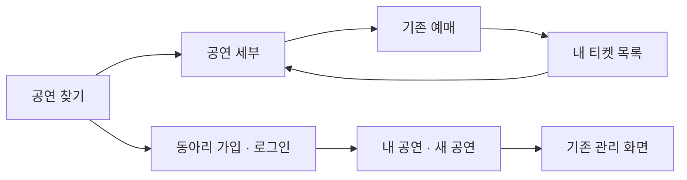
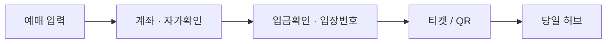
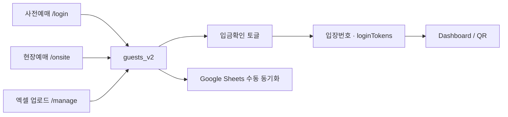
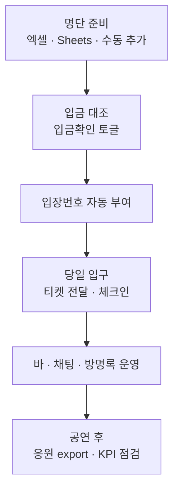
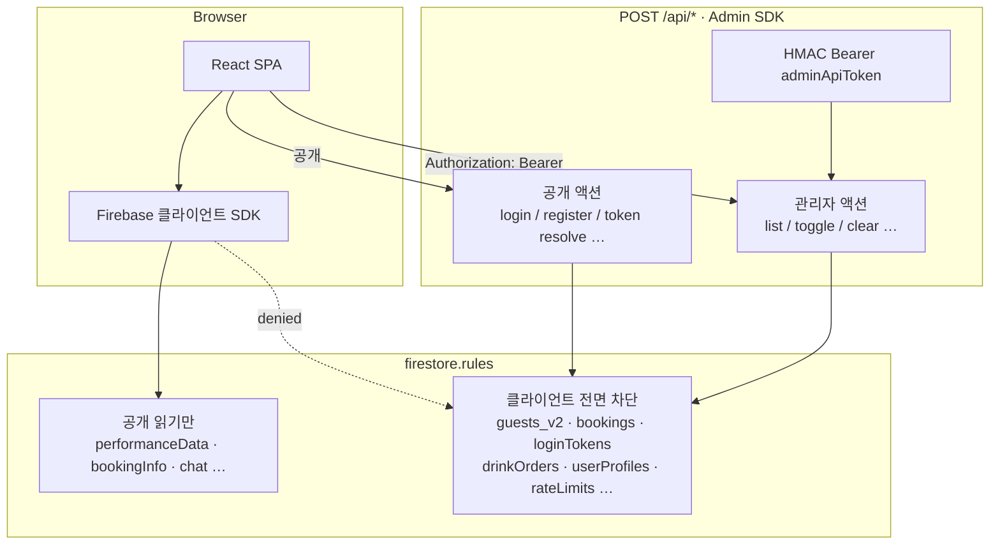
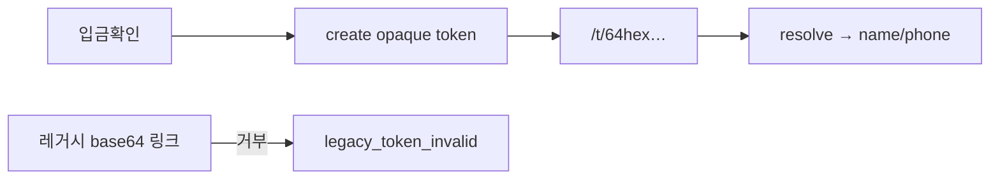
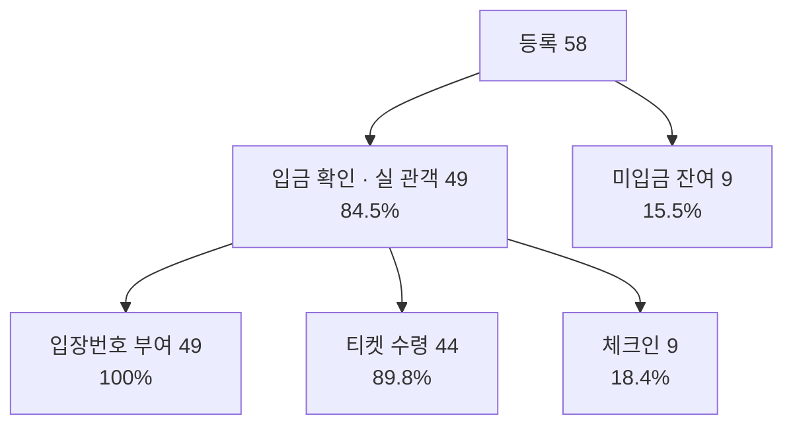
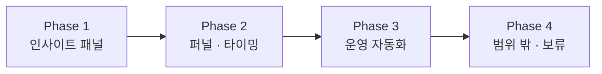

# 밴드 공연 관리 웹

인디/대학 밴드 공연의 **예매 → 입금 확인 → 입장번호·티켓 → 당일 경험(셋리스트·채팅·방명록·주류)** 을 한 웹앱으로 잇는 운영·관객 허브입니다.

실제 공연 적용 사례: **Summer Night Live** (2026.08.15 · OO홀)

| | |
|---|---|
| 사전/현장 예매 | `/login`, `/onsite` |
| 관객 대시보드 | `/dashboard` |
| 관리자 콘솔 | `/manage` |
| 공연·채팅·방명록 | `/performances`, `/chat`, `/guestbook` |

이 저장소(`bandy`)는 위 단일 공연 앱의 코드와 기록을 그대로 가져온 뒤, 여러 동아리가 공연을 올리는 방향으로 고치기 위한 작업 공간입니다.

---

## 앞으로 수정하는 방향

한 공연만 운영하던 앱을, 동아리·팀이 자기 공연을 올리고 관객은 그중 하나를 골라 예매하는 구조로 바꿉니다. 색과 폰트는 기존 화면과 같게 두고, 웹과 모바일은 화면 너비로만 나눕니다.

찾는 화면은 새로 두고, **예매하기 이후는 이미 있는 서비스**를 그대로 씁니다. 예매, 현장 예매, 티켓 대시보드, 공연 정보, 채팅, 방명록, 부가 기능, 운영진 로그인, 관리자 화면을 다시 만들지 않고 라우터만 그 페이지에 연결합니다.



### 관객

| 화면 | 동작 |
|------|------|
| `/` 공연 찾기 | 공개된 공연을 고릅니다. |
| `/e/:eventId` | 그 공연의 세부 페이지입니다. |
| 헤더 | 로그인, 내 티켓, 공연 올리기를 나란히 둡니다. |
| 내 티켓, 로그인 전 | 이동하지 않고 "로그인 해주세요"를 보여 줍니다. |
| `/me` 내 티켓 | 예매한 공연을 티켓 이미지 줄로 위에서 아래로 보여 줍니다. 많이 있어도 한 화면에 들어오게 짧게 둡니다. |
| 티켓에서 들어가기 | 티켓 대시보드로 바로 가지 않고, 그 공연의 세부 페이지로 갑니다. |
| 티켓 대시보드 | 상단 **공연 찾기**로 홈에 돌아갈 수 있습니다. |

### 동아리

공연 올리기는 관리 화면으로 바로 들어가지 않습니다. 먼저 동아리 로그인 또는 회원가입에서 동아리 정보를 입력합니다. 로그인한 뒤에만 **내 공연**, **새 공연**, **동아리**가 나옵니다. 공연 관리는 기존 `/manage` 화면을 `/host/e/:eventId`에 붙입니다.

### 지금 연결된 것과 아직 데모인 것

- 연결됨: 공연 찾기, 공연 세부, 동아리 공개 페이지, 내 티켓 목록, 동아리 가입·로그인 뒤의 내 공연. 예매하기·현장 예매·운영진 로그인·티켓 대시보드·관리 화면은 기존 페이지입니다.
- 아직 데모: 동아리와 공연 목록은 브라우저 `sessionStorage`에 있습니다. 실제 예매·입금 확인·입장번호는 예전처럼 공연이 하나인 서버를 씁니다.
- 다음: 서버의 게스트·공연 정보를 공연마다 나누고, 동아리 계정과 올린 공연을 그 저장소에 붙입니다. 내 티켓은 그 사람이 예매한 공연만 서버에서 읽어 옵니다.

아래 "앞으로 어떻게 개선할지"의 집계·자동화는 공연 하나 운영에 대한 계획으로 남겨 둡니다. 여러 공연을 올리는 일은 그때 "범위 밖"이었고, 이제 이 저장소의 작업 방향입니다.

---

## 왜 만들었나

공연 운영은 보통 **구글폼 · 엑셀 · 카톡 · 계좌 대조**가 흩어집니다.

- 입금자명과 예매명이 어긋나면 톡으로 다시 확인
- 입금 확인과 입장 권한이 단절됨
- 현장 손님·재접속마다 개인 링크를 다시 찾아 보냄
- 티켓·셋리스트·채팅이 제각각이라 관객이 헤맴

이 프로젝트의 목표는 기능 나열이 아니라, **끊긴 흐름을 한 번에 잇는 것**입니다.



---

## 기능별 설명

### 1. 사전 예매 · 로그인 (`/login`)


| | |
|---|---|
| **하는 일** | 이름(입금자명)·연락처로 예매/재로그인 |
| **왜 필요했나** | 카톡 링크·엑셀 명단 대신, 관객이 같은 URL로 다시 들어와 티켓·당일 화면에 도달해야 함 |
| **수집 데이터** | `name`, `phone`, `bookings/{name_phone}` (`createdAt`, `approved`) |

---

### 2. 현장 예매 (`/onsite`)


| | |
|---|---|
| **하는 일** | 현장 손님 이름·연락처 입력 → 계좌/금액 안내(클릭 복사) → 결제완료 → QR·개인 링크 |
| **왜 필요했나** | 당일 손님은 사전 명단에 없고, 계좌를 톡으로 반복 공유하면 실수가 잦음. 키오스크형 원화면으로 예매·입금 안내를 끝냄 |
| **수집 데이터** | `isWalkIn: true`, `paymentConfirmed` (현장은 결제완료 시 확인 처리), 입장번호·토큰 링크 |

---

### 3. 관객 · 운영진 대시보드 (`/dashboard`, `/admin/dashboard`)


| | |
|---|---|
| **하는 일** | 티켓·타임라인·닉네임·주류 바로가기. 운영진은 **현재 통계**(총 게스트 / 실 관객)와 게스트 리스트 확인 |
| **왜 필요했나** | 입금 후에도 “내 티켓·셋리스트·채팅이 어디?”가 반복됨. 한 홈에서 당일 경험을 묶음 |
| **운영 KPI** | `총 게스트` = 삭제되지 않은 게스트 수<br>`실 관객` = `paymentConfirmed === true` 인 게스트 수 |

---

### 4. 관리자 페이지 (`/manage`)


| 섹션 | 역할 | 왜 필요했나 |
|------|------|-------------|
| **게스트 리스트** | 입금확인 토글, 입장번호 순/입금확인 순 정렬, 사전·현장 뱃지, 수동 추가 | 입금 대조와 입장 권한을 한 화면에서 |
| **엑셀 업로드** | 이름·전화번호·입금확인 일괄 반영, Storage `게스트_목록.xlsx` 동기화 | 기존 사전 예매 명단을 버리지 않고 이관 |
| **Google Sheets** | 게스트+닉네임+예매일시 수동 업로드 | 현장 밖에서도 명단을 스프레드시트로 공유 |
| **주류 구매 내역** | 맥주/모히토 수량·금액·제공 여부 | 당일 바 매출·미제공 주문 추적 |
| **셋리스트·공연진** | 엑셀 업로드 / 자동 추출 / 수동 추가 | 셋리스트와 운영진 로그인 권한의 기준 |
| **예매 정보** | 계좌·현장가·환불·안내 전화 | 관객 화면의 입금 안내 단일 소스 |
| **응원·채팅 관리** | 곡별 응원 메시지 엑셀 export, 채팅 일괄 삭제 | 공연 후 아카이브·초기화 |

---

### 5. 공연 정보 · 방명록 · 채팅 · 기타

당일 경험 화면은 네비(홈 / 공연 정보 / 채팅)와 부가 기능으로 나뉩니다. 아래는 **현재 프로덕션 UI** 기준 캡처입니다.


| 화면 | 역할 | 왜 필요했나 |
|------|------|-------------|
| **공연 정보** | 밴드별 셋리스트·곡 상세 | 종이 셋리스트 대신 당일 기준 정보 |
| **방명록** | 메모지 색 선택 후 이름·메시지 남기기 / 모아보기 | 공연 후기·응원을 디지털로 남김 |
| **채팅** | 실시간 채팅 + 온라인 인원 | 대기열·공연 중 관객·운영 소통 |
| **홈·기타** | 티켓·입장번호·길찾기·타임라인·주류 등 | 당일 부대 경험을 같은 앱에 묶음 |

---

## 데이터는 어떻게 모이나

### 관객 권한 파이프라인

예매 채널이 달라도 같은 `guests_v2`로 모이고, **입금확인이 권한 스위치**가 됩니다.



### 당일 경험 · 콘텐츠 파이프라인

관객 허브와 공연 콘텐츠는 게스트 권한과 별도로 쌓입니다.

```mermaid
flowchart LR
  F[Events 주류] --> O[drinkOrders]
  H[Guestbook] --> M[messages]
  T[Chat] --> CH[chat + onlineUsers]
  S[셋리스트 엑셀] --> PD[performanceData]
  PD --> PERF[/performances]
  O --> EV[/events]
  M --> GB[/guestbook]
  CH --> CT[/chat]
```

### 운영자 하루 파이프라인



| 저장소 | 주요 필드 |
|--------|-----------|
| **Firestore `guests_v2/all`** | `name`, `phone`, `isWalkIn`, `paymentConfirmed`, `paymentConfirmedAt`, `entryNumber`, `ticketReceived`, `checkedIn`, `isDeleted` |
| **`bookings/{name_phone}`** | 예매 신청 시각·승인 |
| **`bookingInfo/main`** | 계좌, 현장가, 환불, 연락처 |
| **`performanceData/main`** | ticket, setlist, performers, events |
| **`drinkOrders`** | 수량, `totalAmount`, 입금/제공 여부, `orderHistory` |
| **`messages` / `chat` / `songComments`** | 방명록·채팅·곡별 응원 |
| **localStorage** | `guests_v2`, `bookingInfo`, `performanceData` (오프라인 보조) |
| **Firebase Storage** | `guests/게스트_목록.xlsx` |
| **Google Sheets** | 운영용 미러 (닉네임·예매일시 포함) |

---

## 보안 — 실사용자를 위해 잠근 것

이름·전화번호·계좌·개인 링크가 오가는 **실서비스**라서, 초기 “클라이언트에서 Firestore 직접 읽고 쓰기” 구조에서 **서버 API + 규칙 차단** 구조로 옮겼습니다.  
목표는 브라우저 DevTools / Firebase 콘솔 규칙만으로 **게스트 명단·예매·토큰을 훑지 못하게** 하는 것입니다.

### 한눈에 보는 경계



### 1) Firestore: 민감 컬렉션은 클라이언트 접근 불가

활성 규칙: [`firestore.rules`](./firestore.rules)  
(예전 전부 개방 규칙은 [`firestore-rules.txt`](./firestore-rules.txt)에만 남아 있습니다.)

| 구분 | 컬렉션 | 클라이언트 |
|------|--------|------------|
| **차단** | `guests`, `guests_v2`, `bookings`, `loginTokens`, `userProfiles`, `drinkOrders`, `analytics_events`, `rateLimits`, `rpsTournament` | `read`/`write` 모두 `false` → **Admin SDK + `/api/*`만** |
| **읽기만** | `performanceData`, `bookingInfo`, `chat`, `onlineUsers`, `messages`, `songComments`, `roulette`, `entryDraw`, `current`, `entries` | 공개 읽기 / 쓰기는 서버 |

게스트 문서는 V2로 분리했습니다: `guests_v2/all` ([`src/config/firestorePaths.ts`](./src/config/firestorePaths.ts)).

### 2) `/api/guests` — 공개 액션 vs 관리자 액션

핸들러: [`server/lib/guestsApi.js`](./server/lib/guestsApi.js) · 클라이언트: [`src/services/guestsApi.ts`](./src/services/guestsApi.ts)

| | 액션 | 인증 |
|---|------|------|
| **공개** | `login`, `status`, `check`, `register`, `onsite-payment` | 이름·전화 신원 매칭 |
| **관리자** | `list`, `upload`, `toggle-payment`, `toggle-ticket`, `delete`, `update`, `clear`, `deduplicate`, `fix-phones` | `Authorization: Bearer` (HMAC) |

- 공개 응답은 [`toPublicGuest()`](./server/lib/guestNormalize.js)로 필드 축소
- 관리자 리스트는 브라우저가 Firestore를 직접 읽지 않고 **API만** 사용
- 삭제는 하드 딜리트 대신 `isDeleted` 소프트 삭제

### 3) 관리자 비밀번호 · HMAC 토큰 · 무차별 대입 제한

| 단계 | 구현 |
|------|------|
| 코드 검증 | [`server/lib/verifyAdminCode.js`](./server/lib/verifyAdminCode.js) — `ADMIN_LOGIN_CODE` / `ADMIN_ACTION_PASSWORD`, SHA-256 + `timingSafeEqual` |
| 토큰 발급 | [`server/lib/adminToken.js`](./server/lib/adminToken.js) — HMAC-SHA256 Bearer, TTL **14일** |
| 레이트리밋 | [`server/lib/rateLimit.js`](./server/lib/rateLimit.js) — IP 해시, `verify-admin-code` 기준 **실패 5회 / 15분 → 429** |
| `/manage` 게이트 | [`ManageProtectedRoute`](./src/components/ManageProtectedRoute.tsx) + [`manageSession`](./src/utils/manageSession.ts) — action 비밀번호 + `adminApiToken` |

운영진 로그인(`AdminLogin`)은 서버 코드 확인 + 공연진 명단 매칭을 거칩니다.

### 4) 개인 링크 — URL에 이름·전화 넣지 않음

레거시 `base64(이름|전화)` 링크는 **거부**합니다 (`legacy_token_invalid`).  
지금은 64자 hex 불투명 토큰만 허용합니다.

| | |
|---|---|
| 구현 | [`server/lib/loginTokensApi.js`](./server/lib/loginTokensApi.js) |
| 컬렉션 | `loginTokens` (클라이언트 차단) |
| TTL | 30일 · `revoked` / `expired` → 410 |
| 경로 | `/t/:token` |



### 5) `paymentConfirmed` = 서버 쪽 권한 스위치

입금 확인 전후로 UI만 막는 게 아니라, **채팅 전송·프레즌스** 등은 서버에서 `requirePayment: true`로 검증합니다 ([`server/lib/chatApi.js`](./server/lib/chatApi.js) → `payment_required`).  
입장번호·티켓·당일 허브도 같은 플래그를 기준으로 열립니다.

### 6) API 라우터 · 기타 잠금

| 항목 | 내용 |
|------|------|
| 단일 엔드포인트 | [`api/index.js`](./api/index.js) — Hobby 플랜용 `/api/*` 라우터, **POST만**, 봇 스캔 경로 404 |
| 쓰기 경로 | 공연/예매 정보·게임·메일 등 민감 write는 admin Bearer ([`booking-info`](./server/lib/bookingInfoApi.js), [`performance-data`](./server/lib/performanceDataApi.js), [`games`](./server/lib/gamesApi.js), …) |
| 분석 경로 | [`sanitizePath`](./src/analytics/sanitizePath.ts) — `/t/*`, `/api/*` 등 민감 path 정리 |
| 환경 변수 | `FIREBASE_SERVICE_ACCOUNT`, `ADMIN_LOGIN_CODE`, `ADMIN_ACTION_PASSWORD`, `ADMIN_TOKEN_SECRET` (클라이언트 번들에 비밀 넣 않음) |

### 관련 파일 인덱스

| 파일 | 역할 |
|------|------|
| [`firestore.rules`](./firestore.rules) | 컬렉션별 클라이언트 허용/차단 |
| [`api/index.js`](./api/index.js) | Vercel API 라우터 |
| [`server/lib/guestsApi.js`](./server/lib/guestsApi.js) | 게스트 공개/관리자 ACL |
| [`server/lib/guestAuth.js`](./server/lib/guestAuth.js) | 게스트 신원 · 입금 여부 검증 |
| [`server/lib/adminToken.js`](./server/lib/adminToken.js) | HMAC Bearer |
| [`server/lib/verifyAdminCode.js`](./server/lib/verifyAdminCode.js) | 관리자 코드 검증 |
| [`server/lib/rateLimit.js`](./server/lib/rateLimit.js) | 관리자 코드 브루트포스 제한 |
| [`server/lib/loginTokensApi.js`](./server/lib/loginTokensApi.js) | 불투명 개인 링크 |
| [`src/utils/manageSession.ts`](./src/utils/manageSession.ts) | `/manage` 세션 게이트 |
| [`src/services/guestsApi.ts`](./src/services/guestsApi.ts) | 클라이언트 → API (토큰 첨부) |

---

## 관리자 데이터 분석 (실제 Firestore 기준)

분석 시점: 공연 메타·참여 데이터가 Firestore에 남아 있는 상태를 기준으로 정리했습니다.  
(`guests_v2`는 배포 규칙상 외부 직접 조회가 막혀 있거나 공연 후 초기화된 상태로, **게스트 수 KPI는 대시보드·관리자 화면의 집계 로직**을 기준으로 설명합니다.)

### 1) 공연 운영 메타 (확인됨)

| 항목 | 값 |
|------|-----|
| 공연명 | **Summer Night Live** |
| 일시 | 2026년 8월 15일 (토) |
| 장소 | OO홀 (서울시 OO구 OO로 00) |
| 좌석 | 자유석 |
| 셋리스트 | **24곡** |
| 공연진(운영진 포함 명단) | **38명** |
| 타임라인 | 관객 입장 16:30 → 밴드A 17:00 → 밴드B 18:00 → 밴드C 19:00 |
| 입금 계좌 | 국민은행 / 예금주 ●●● (계좌번호 마스킹) |
| 가격 안내 | 현장 예매 기준 안내(관리 화면·`bookingInfo`에 반영) |

셋리스트 일부: 첫 곡(아티스트 A), 두 번째 곡(아티스트 B), 세 번째 곡(아티스트 C), …, 앙코르(아티스트 F)

### 2) 관객 퍼널 KPI (실제 수집 데이터)

기준: 공연 **Summer Night Live** (2026-08-15) · Firestore `guests_v2` 게스트 **58명**  
(실명·연락처·실제 공연명/팀명은 비공개. 집계만 공개)

#### 퍼널 한눈에



| KPI | 정의 | 실제 수치 | 해석 |
|-----|------|-----------|------|
| 총 게스트 | `!isDeleted` | **58명** | 명단 규모 |
| 실 관객 | `paymentConfirmed === true` | **49명** | 입금·입장 권한이 열린 규모 |
| 입금 전환율 | 실 관객 ÷ 총 게스트 | **84.5%** | 미입금 9명(15.5%)이 잔여 리마인드 대상 |
| 사전 vs 현장 | `isWalkIn` | 사전 **58** / 현장 **0** | 이번 공연 데이터는 전원 사전 예매로 기록됨 (`isWalkIn` 미사용 또는 현장 미집계) |
| 입장번호 부여율 | `entryNumber` (실 관객 기준) | **100%** (49/49) | 입금 확인 후 번호 파이프라인은 완전 작동 |
| 티켓 수령률 | `ticketReceived` (실 관객 기준) | **89.8%** (44/49) | 입금 후에도 티켓 미수령 5명 → 입구 전달 누락 가능 |
| 체크인율 | `checkedIn` (실 관객 기준) | **18.4%** (9/49) | 티켓 수령(44)과 괴리 → 체크인 토글이 현장에서 거의 안 쓰임 |
| 예매→입금 지연 | `bookedAt` → `paymentConfirmedAt` | 중앙값 **~3분**, 평균 **~21시간**, P90 **~5일** | 과반은 즉시 확인, 꼬리(지연 입금)가 평균을 끌어올림 |

#### 입금 확인 타이밍 (실 관객 49명)

| 구간 | 인원 | 비중 |
|------|------|------|
| 즉시 (~1분) | 21 | 42.9% |
| 1시간 미만 | 14 | 28.6% |
| 1~24시간 | 9 | 18.4% |
| 3~7일 | 3 | 6.1% |
| 7일+ | 2 | 4.1% |

입금 확인 **일자(KST)** 분포: 공연 며칠 전부터 분산 입금 → **공연 당일 16명**으로 당일 확정이 가장 많았고, 시간대는 **21시·17시** 전후 피크.

#### 분석 결론

1. **입금 확인이 진짜 병목 스위치** — 등록 58 → 실 관객 49로 떨어지며, 미입금 9명은 공연 후에도 명단에 남아 있음(장기 미입금).
2. **입장번호는 자동화 성공** — 실 관객 전원에 번호가 붙음.
3. **티켓 수령 ≠ 체크인** — 수령 44 vs 체크인 9. 운영이 “티켓 전달”은 했지만 “체크인 토글”은 거의 안 눌러, 대시보드 실입장 집계가 과소 집계됐을 가능성.
4. **현장(`isWalkIn`) 신호 부재** — 이번 스냅샷만 보면 현장 예매 비중을 나눌 수 없음. 다음 공연에선 `/onsite` 경로 플래그·집계 UI를 반드시 검증할 것.
5. **지연 입금 꼬리** — 즉시 확인이 71%이지만 3일+ 지연이 5명. 미입금 리마인드는 **24시간 / 72시간** 두 번에 거는 게 맞음.

게스트 리스트 **「입금 확인 순」** 정렬은 위 미입금·지연 큐를 공연 직전 운영자가 위로 모아 처리하도록 설계된 기능입니다.

### 3) 참여·매출 보조 지표 (확인됨)

| 소스 | 관측 | 해석 |
|------|------|------|
| 방명록 `messages` | 메모지 메시지 다수 게시(공연명 배너와 함께 노출) | 공연 후기·응원 채널로 사용됨 |
| 채팅 `chat` | 운영진·게스트 메시지 기록 (발신자 실명은 비공개) | 당일 실시간 소통 채널로 동작 |
| 주류 `drinkOrders` | 관리자 **주류 구매 내역**으로 건별 수량·금액·제공 여부 확인 | 바 매출·미제공 주문 운영 |
| Google Sheets | 수동 업로드 버튼으로 명단 외부 공유 | 엑셀 중심 운영과의 브리지 |

### 4) 분석에서 드러난 운영 패턴

1. **입금 확인이 권한의 스위치** — 등록 58 → 실 관객 49(84.5%). 채팅·일부 이벤트도 `paymentConfirmed` 이후에만 열림.
2. **티켓 수령과 체크인 분리** — 수령 89.8% vs 체크인 18.4%. “전달”과 “입장 집계” 운영 습관이 달라 대시보드 실입장 수치가 낮게 나옴.
3. **현장 플래그 공백** — `isWalkIn`이 전원 false/미설정. 사전·현장 비중 분석이 이번 회차에선 불가능.
4. **공연 콘텐츠는 풍부, 집계 UI는 얇음** — 셋리스트 24곡·공연진 38명은 들어가 있지만, 위 KPI는 API로 뽑아 본 결과이며 관리자 화면에 차트로는 아직 없음.

---

## 앞으로 어떻게 개선할지

데이터가 이미 Firestore에 쌓이는 구조를 전제로, **새 수집보다 집계·자동화**를 우선합니다.



### Phase 1 — 관리자 인사이트 패널 (`/manage` 상단)

- 사전/현장 비율, 입금 전환율, 미입금 N시간 이상 건수
- 티켓 미수령 · 입장번호 미부여 알림
- 주류: 맥주/모히토 합계, 매출 합, 미제공 건수

### Phase 2 — 퍼널·타이밍

- 예매 생성 → 입금 확인 중앙값/평균 지연
- 시간대별 현장 예매·주류 주문 피크 (입구·바 인력 배치)
- 곡별 응원(`songComments`) 히트맵 → 셋리스트 피드백

### Phase 3 — 운영 자동화

- Google Sheets **자동** 동기화(현재는 수동)
- 미입금 리마인드(문자/메일 — 선택)
- 공연 종료 후 익명화된 KPI 스냅샷 export (다음 공연 벤치마크)

### Phase 4 — 범위 밖의 것 (당분간 안 함)

- PG 자동결제 (계좌이체 안내 유지)
- 네이티브 앱·푸시
- 좌석 지정·실시간 좌석맵

여러 동아리가 공연을 올리는 구조는 여기서 빼서, 위 **앞으로 수정하는 방향**에서 진행합니다.

---

## 기술 스택

- React 18 · TypeScript · Vite · React Router
- Firebase (Firestore · Storage)
- xlsx (엑셀 업로드/다운로드)
- Google Apps Script (Sheets 연동)

## 시작하기

```bash
npm install
npm run dev
```

브라우저: `http://localhost:5173`

환경 변수는 `.env.local`에 `VITE_FIREBASE_*`, `VITE_GOOGLE_SHEETS_WEB_APP_URL` 을 넣습니다. (`.env` / `.env.local` 은 gitignore)

### 빌드

```bash
npm run build
npm run preview
```

## 주요 경로

| 경로 | 설명 |
|------|------|
| `/login` | 사전 예매·로그인 |
| `/onsite` | 현장 예매 |
| `/dashboard` | 관객 홈 |
| `/manage` | 관리자 콘솔 |
| `/admin/login` | 운영진 로그인 |
| `/performances` | 공연 정보 |
| `/chat` | 채팅 |
| `/guestbook` | 방명록 |
| `/events` | 주류·미니게임 등 |
| `/t/:token` | 개인 티켓 링크 |
| `/` | 공연 찾기 |
| `/e/:eventId` | 공연 세부. 예매는 `/e/:eventId/book` |
| `/o/:organizerId` | 동아리 공개 페이지 |
| `/me` | 로그인한 관객의 티켓 목록 |
| `/host` | 동아리 로그인·회원가입 후 내 공연 |
| `/intro.html` | 사업소개 HTML (5장) |

## 엑셀 게스트 형식

필수 컬럼: `이름` / `name`, `전화번호` / `phone`  
선택: `입금확인` (확인완료, Y, 1 등)

## 라이선스

MIT
