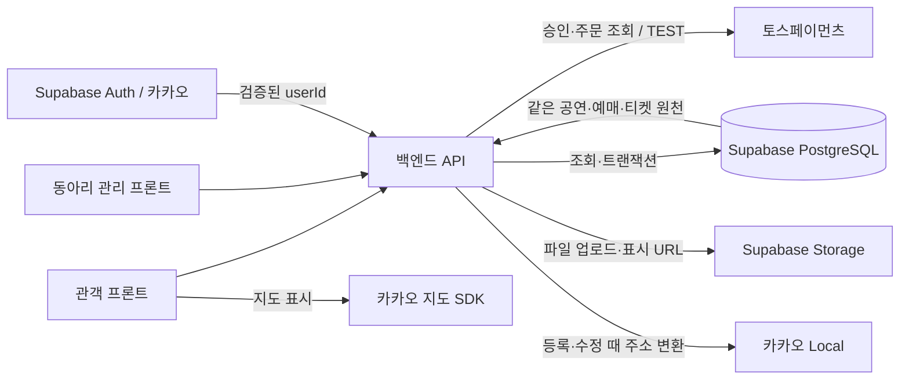
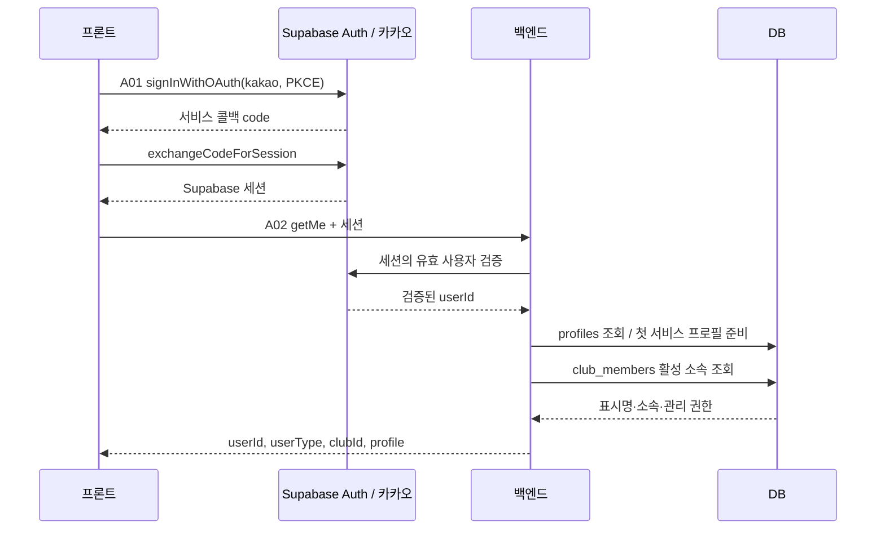
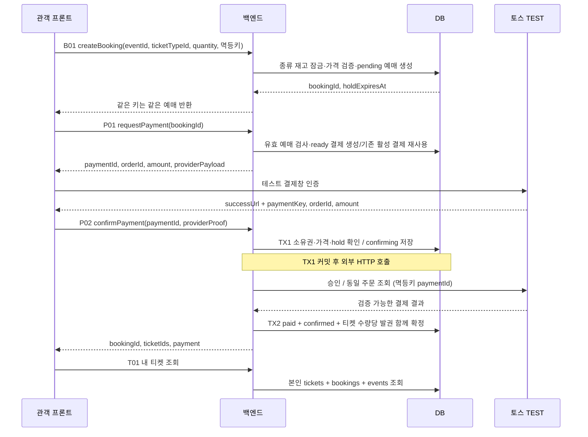
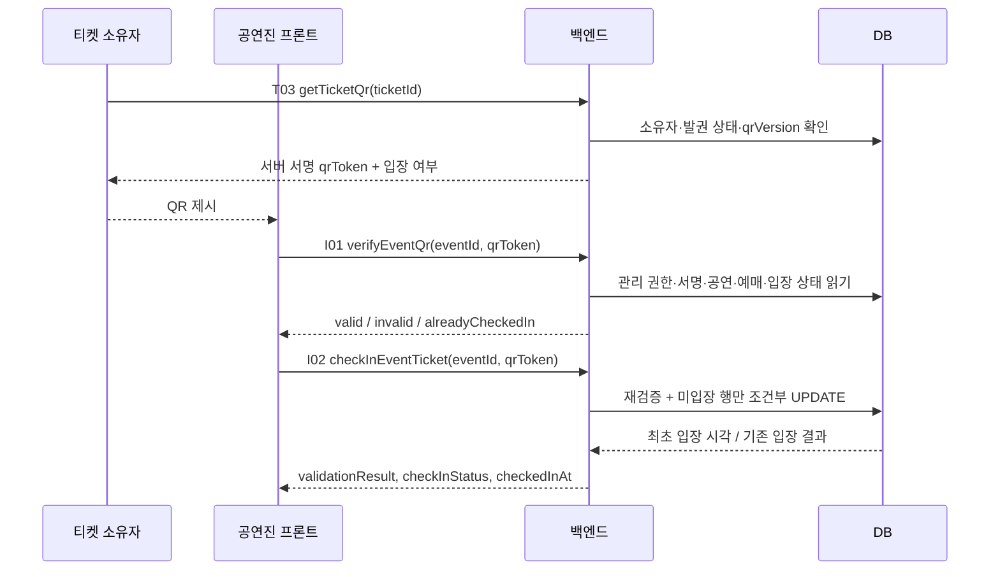

# Bandy 백엔드 데이터 플로우

2026-10-07 · 설계 초안 · 근거: [밴디 기능 추가](https://app.notion.com/p/3f0b2368087980878fa2f2efb1e0ae58)

본인이 API·외부 연동·데이터 흐름·DB 구조를 설계한다. Supabase 프로젝트 생성·설정·배포는 우리 담당이 아니다. 아래 화살표는 설계한 데이터 이동이며 실제 연동 테스트 결과가 아니다. 경로의 `/api/v1` 접두어는 제안이며 배포 주소·서버 실행 환경은 팀이 확인한다.

## 전체 데이터 연결

DB 연결은 `auth.users.id → profiles.id → bookings.user_id → tickets.user_id`로 이어진다. 공연은 `events.club_id`로 주최 동아리와 연결되고, 예매는 `bookings.event_id`와 `ticket_type_id`로 공연·티켓 종류와 연결된다. 개인 티켓과 동아리 예매자 목록을 별도로 복제하지 않는다.

## 로그인·회원 유형

- A01은 프론트 SDK 연동 항목이며 별도의 백엔드 로그인 엔드포인트를 중복 구현하지 않는 안이다.
- `userType`은 활성 동아리 소속 유무에서 도출한다. 동아리 회원도 본인 예매·티켓 기능을 이용한다.
- 백엔드는 요청 본문에 전달된 `userId`, `userType`, `clubId`를 인증·관리 권한의 근거로 사용하지 않는다.
- 카카오·Supabase 제공자와 콜백 설정은 세팅 담당 작업이다. 이메일 수집 없이 표시명만 사용하는 최소안이며 실제 동의 항목은 해당 앱 설정을 확인한다.

## 공연·지도·캘린더 조회

1. C05/C06에서 공연명·설명·일시·장소·이미지 참조·티켓 종류를 전달한다.
2. 서버는 주최 동아리 관리 권한과 이미지 소유자·용도·동아리를 확인한다. 주소 좌표 변환이 필요하면 쓰기 트랜잭션 전에 카카오 Local을 호출한다. 응답의 `x`는 경도, `y`는 위도다.
3. `events`와 `ticket_types`를 한 트랜잭션으로 등록한다. 공연 날짜·시간은 Asia/Seoul의 `starts_at` 하나로 저장하는 안이다.
4. E01은 목록·검색·장르/장소/날짜·지도 조건을 같은 공연 원천에 적용한다. 지도는 저장된 위경도를 대상으로 반경 조회한다. 반경 단위는 미터 제안이다. 매 조회마다 외부 주소 변환을 호출하지 않는다.
5. E02는 공연·주최 동아리·이미지·티켓 종류를 조인한다. C02는 주최 동아리 기본 정보만 조회한다. 보류된 동아리 찾기 D01과 구분한다.

좌표가 없는 공연은 지도 반경 결과에서 제외하는 안이며 일반 목록·날짜 조회에서는 볼 수 있다. 좌표 조건 세 개(latitude/longitude/radius)는 함께 받아 검증한다. 장르 분류·날짜 검색 범위·페이지 상한은 팀 결정이 필요하다.

## 예매·결제·발권

**가격과 재고:** 클라이언트가 보낸 금액을 결제 가격으로 사용하지 않는다. B01에서 `ticket_types.price_krw × quantity`를 예매 가격 스냅샷으로 저장하고 P01/P02는 이 값을 사용한다. 종류의 `reserved_count`는 미해제 pending과 confirmed의 수량 합이다. `remaining`은 참고용 조회 값이며 실제 재고 확보는 잠금/조건부 변경으로 수행한다.

**중복 요청:** B01의 `(user_id, idempotency_key)`가 같은 요청은 같은 예매를 반환한다. 키가 같아도 공연·종류·수량이 다르면 409다. P01은 ready/confirming 결제를 재사용한다. failed는 유효 hold 안에서 새 orderId로 재시도할 수 있다. confirmed/expired 예매는 다시 결제 준비하지 않는다.

**승인 전·후:** ready에서 처음 confirming으로 바꿀 때 hold가 끝났으면 업체 승인 API를 호출하지 않는다. confirming으로 저장한 예매의 재고는 승인 여부를 확실히 알 때까지 해제하지 않는다. 업체의 `DONE`, `orderId`, 금액·통화를 검증한 뒤 paid·confirmed·발권을 함께 커밋한다. 중복 승인 응답은 기존 ticketIds를 반환한다.

**실패·복구:** 확정적인 업체 거절만 failed로 저장한다. timeout·5xx·서버 중단처럼 결과가 불명확하면 confirming을 유지한다. P02 재호출/P03 확인 또는 후속 복구 작업에서 토스 주문조회로 실제 결과를 확인하고 같은 확정 경로를 재사용한다. 외부 승인 직후 DB 저장에 실패해도 저장한 paymentKey/orderId를 이용해 복구한다. confirming 재고를 무조건 시간 만료로 풀면 안 된다. 장시간 불명확한 결제의 운영 처리와 복구 실행 주기는 구현 단계에서 결정한다.

**잠금 순서 제안:** 모든 예매·만료·결제 확정 경로는 `ticket_types → bookings → payments` 순서를 통일한다. 같은 타입의 만료 예매를 정리한 뒤 새 재고를 확보한다. 여러 종류를 수정하는 경우 타입 ID 순서로 잠근다. 결제 HTTP 동안 DB 잠금을 유지하지 않는다.

**커밋 시 관계:** confirmed 예매에는 동일 금액 paid 결제 1건과 정확히 quantity개의 티켓이 있어야 한다. 티켓의 예매·공연·회원·종류는 모두 일치해야 한다. 커밋 시 검증하는 제약/검증 함수와 원자적 쓰기로 보장할 설계이며 아직 DB에 적용한 상태가 아니다.

hold 기간·최대 수량·무료 공연·좌석·취소·환불 정책은 미정이다. 이번 안은 유료 KRW와 수량당 한 장 발권을 기준으로 설명한다. 실제 거래·환불 API를 이번 문서 작업에서 실행하지 않는다.

## QR 검증·입장

- I01은 읽기만 수행한다. I01이 valid였더라도 I02에서 모든 조건을 다시 확인한다.
- QR 설계안은 ticketId·qrVersion를 서버의 HMAC으로 서명하는 방식이다. 서명키는 서버 환경에만 둔다. GET T03은 저장 값을 변경하지 않고 동일 토큰을 재생성할 수 있다. 다른 선택지인 무작위 토큰은 DB에 해시만 저장하면 다시 표시할 원문을 복원할 수 없어, 원문 보관/암호화 또는 별도 발급 흐름이 필요하다. QR 구현·유효기간은 아직 확정하지 않았다.
- 권한은 공연의 `club_id`와 공연진의 활성 소속으로 검사한다. 다른 공연의 티켓이나 잘못된 서명은 invalid다.
- `checked_in_at IS NULL`인 유효 티켓만 시각·관리자를 함께 변경한다. 동시에 두 번 스캔해도 한 번만 변경되고 나머지는 alreadyCheckedIn이 되는 설계다. 재입장은 미정이다.
- 입장 후 기존 서비스로 가는 화면·인증·eventId 전달 방식은 기존 담당자와 확인한다. 새 연결 API를 임의로 추가하지 않는다.

## 개인·동아리 조회가 일치하는 이유

| 조회 | 원천과 조건 | 결과 |
|---|---|---|
| B02 본인 예매 | bookings.user_id = 검증 회원 | 본인 예매 상태·연결 티켓 |
| T01/T02 본인 티켓 | tickets.user_id = 검증 회원 | 발권 티켓·공연·입장 상태 |
| C08 공연 예매자 | tickets + bookings + profiles + ticket_types; 주최 권한 | 같은 티켓의 표시명·예매·입장 상태 |
| C04 동아리 공연 집계 | 동일 tickets를 공연별 집계 | 확정 티켓 수/입장 완료 티켓 수 제안 |

예매자 목록은 발권된 티켓을 기준으로 하는 안이다. 결제 전 예매까지 관리 화면에 보일지는 팀 결정이다. `bookingCount`를 예매건 수로 부를지 발권장 수로 부를지도 확정해야 하며, 현재 초안은 발권장 수다.

홈·알림·설정은 같은 DB의 events/notifications/user_settings 조회안이다. 원문만으로 외부 소식 공급이나 알림 생성 규칙을 확정할 수 없어 별도의 공급 서비스·메시지 발송 API를 추가하지 않았다.

## 확인 범위

노션 본문과 기존 API 초안을 대조했고 Claude 사전 설계 검토를 반영했다. 외부 와이어프레임·Figma 상세 화면, 기존 서비스 코드, Supabase 실제 프로젝트는 확인하지 않았다. 이 문서는 DB 동시성·권한·업체 연동이 실제로 통과했다는 증거가 아니다.
