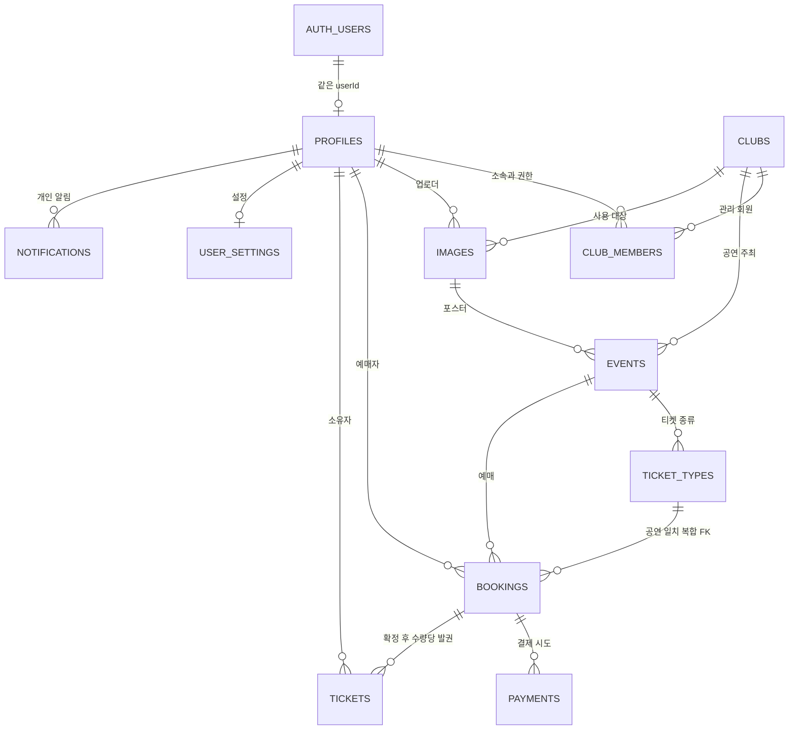

# Bandy DB 구조 설계서

2026-10-07 · 설계 초안 · Supabase 기준

본인은 데이터 관계·테이블·API 대응을 설계한다. Supabase 프로젝트 생성·권한 설정·DB 적용·배포는 우리 담당이 아니다. 아래는 논리·테이블 구조 제안이며 이미 만들어진 DB를 추출한 결과가 아니다.

## ERD

ERD는 핵심 관계를 보여준다. images→clubs의 프로필 이미지 참조와 tickets→profiles의 입장 처리자 참조, 복합 FK의 전체 조건은 컬럼/제약 표에서 확인한다.

## 저장 원칙

- 서비스 테이블명은 PostgreSQL snake_case, API 필드는 camelCase. userId는 Supabase auth.users.id와 같은 UUID 제안이다.
- eventDate/eventTime은 starts_at(timestamptz)을 Asia/Seoul로 나눈 응답이다. checkedInAt 등 시각은 ISO8601로 응답한다.
- 가격은 정수 원화 스냅샷. 예매 금액과 결제 금액·통화가 같아야 한다. 무료/좌석/재입장/환불은 팀 결정 전 미정이다.
- userType, clubName, eventName, ticketType, checkInStatus, remaining, bookingCount는 소속/공연/종류/입장 원천에서 도출한다. 화면별 복제 테이블이나 서로 독립된 집계를 만들지 않는다.
- posterImage/profileImage 요청은 U01 imageRef를 참조하고 조회 응답에서는 표시용 서명 URL로 변환한다. URL 만료 때문에 임시 URL을 영구 저장하지 않는다.
- 원본 테이블 직접 변경을 막고 백엔드에서 검증한 userId·소속을 사용한다. RLS/함수 접근을 실제 적용하는 작업은 세팅 담당에게 전달한다.

## 테이블 정의

### auth.users (Supabase 관리)

Supabase Auth가 관리하는 인증 사용자. 자체 세션·비밀번호 테이블을 만들지 않음

관련 API: A01, A02

| 컬럼 | 타입 제안 | NULL | 키·제약 | API 대응 | 설명 |
| --- | --- | --- | --- | --- | --- |
| id | uuid | 불가 | PK | userId | Supabase 인증 사용자 식별자 |

### profiles

서비스 회원 표시 정보. 개인 기능과 동아리 기능은 같은 회원 사용

관련 API: A02~A04, C08

| 컬럼 | 타입 제안 | NULL | 키·제약 | API 대응 | 설명 |
| --- | --- | --- | --- | --- | --- |
| id | uuid | 불가 | PK/FK → auth.users.id | userId | 인증 사용자와 같은 UUID |
| display_name | text | 불가 | - | profile.displayName / Attendee.name | 서비스 표시명. 실명 아님 |
| created_at | timestamptz | 불가 | - | - | 생성 시각 |
| updated_at | timestamptz | 불가 | - | - | 수정 시각 |

### clubs

공연 주최 동아리·관리 프로필

관련 API: C01~C05, C09

| 컬럼 | 타입 제안 | NULL | 키·제약 | API 대응 | 설명 |
| --- | --- | --- | --- | --- | --- |
| id | uuid | 불가 | PK | clubId | 동아리 ID |
| name | text | 불가 | - | clubName | 동아리 이름 |
| introduction | text | 불가 | - | introduction | 소개. 빈 문자열 허용안 |
| profile_image_id | uuid | 허용 | FK → images.id | profileImage | 프로필 이미지 참조 |
| sns_link | text | 허용 | - | snsLink | SNS URL. 없는 경우 null |
| created_by | uuid | 불가 | FK → profiles.id | 인증 userId | 등록한 회원 |
| created_at | timestamptz | 불가 | - | - | 생성 시각 |
| updated_at | timestamptz | 불가 | - | - | 수정 시각 |

### club_members

회원의 소속과 동아리 관리 권한. userType/clubId는 여기서 도출

관련 API: A02, A03, C01, C03~C09, I01, I02

| 컬럼 | 타입 제안 | NULL | 키·제약 | API 대응 | 설명 |
| --- | --- | --- | --- | --- | --- |
| club_id | uuid | 불가 | 복합 PK/FK → clubs.id | clubId | 소속 동아리 |
| user_id | uuid | 불가 | 복합 PK/FK → profiles.id | userId | 소속 회원 |
| role | text | 불가 | CHECK | 서버 권한 | owner/manager 관리 권한 제안 |
| active | boolean | 불가 | 부분 UNIQUE(user_id) | userType / clubId | 활성 소속 여부. 1활성 소속 제안 |
| created_at | timestamptz | 불가 | - | - | 생성 시각 |

### images

Storage 파일 메타데이터. 버킷 객체 자체는 플랫폼 관리

관련 API: U01, C03, C05, C06

| 컬럼 | 타입 제안 | NULL | 키·제약 | API 대응 | 설명 |
| --- | --- | --- | --- | --- | --- |
| id | uuid | 불가 | PK | imageRef | API imageRef |
| owner_user_id | uuid | 불가 | FK → profiles.id | 인증 userId | 업로더 |
| club_id | uuid | 불가 | FK → clubs.id | clubId | 사용 대상 동아리. 현재 소속에서 확인 |
| purpose | text | 불가 | CHECK | purpose | event_poster/club_profile 제안 |
| object_path | text | 불가 | UNIQUE | 서버 내부 | 비공개 버킷 내부 경로. 클라이언트 입력으로 확정하지 않음 |
| mime_type | text | 불가 | CHECK | file | PNG/JPEG/WebP 제안 |
| byte_size | integer | 불가 | CHECK | file | 파일 크기. 5MB 이하 제안 |
| created_at | timestamptz | 불가 | - | - | 생성 시각 |

### events

관객 조회와 동아리 관리가 함께 참조하는 공연 원천

관련 API: H01, E01~E03, C04~C08, I01, I02

| 컬럼 | 타입 제안 | NULL | 키·제약 | API 대응 | 설명 |
| --- | --- | --- | --- | --- | --- |
| id | uuid | 불가 | PK | eventId | 공연 ID |
| club_id | uuid | 불가 | FK → clubs.id | clubId | 주최 동아리 |
| name | text | 불가 | - | eventName | 공연명 |
| description | text | 불가 | - | description | 공연 소개 |
| starts_at | timestamptz | 불가 | - | eventDate / eventTime | 공연 시작 시각. Seoul 기준 날짜·시간으로 응답 |
| location_text | text | 불가 | - | location | 공연 장소/주소 |
| latitude | double precision | 허용 | CHECK -90..90 | latitude | WGS84 위도. 경도와 함께 입력 |
| longitude | double precision | 허용 | CHECK -180..180 | longitude | WGS84 경도. 위도와 함께 입력 |
| genre | text | 허용 | - | genre | 장르 필터. 분류 체계는 미정 |
| poster_image_id | uuid | 불가 | FK → images.id | posterImage | U01에서 받은 imageRef. 조회 때 표시 URL 생성 |
| is_featured | boolean | 불가 | - | featuredEvents | 홍보 카드 선정 표시 제안. 선정 정책 미정 |
| status | text | 불가 | CHECK | status | published/deleted 상태 제안 |
| created_by | uuid | 불가 | FK → profiles.id | 인증 userId | 공연 등록 회원 |
| created_at | timestamptz | 불가 | - | - | 생성 시각 |
| updated_at | timestamptz | 불가 | - | - | 수정 시각 |
| deleted_at | timestamptz | 허용 | - | - | 논리 삭제일. 삭제 정책은 팀 확정 |

### ticket_types

공연별 티켓 종류·가격·판매 정원

관련 API: E03, B01, C05, C06

| 컬럼 | 타입 제안 | NULL | 키·제약 | API 대응 | 설명 |
| --- | --- | --- | --- | --- | --- |
| id | uuid | 불가 | PK / UNIQUE(id,event_id) | ticketTypeId | 티켓 종류 ID |
| event_id | uuid | 불가 | FK → events.id | eventId | 대상 공연 |
| name | text | 불가 | UNIQUE(event_id,name) | ticketType | 티켓 종류 이름 |
| price_krw | bigint | 불가 | CHECK > 0 (유료안) | priceKrw | 원화 단가. 무료 공연 정책은 미정 |
| capacity | integer | 불가 | CHECK > 0 | capacity | 판매 정원 |
| reserved_count | integer | 불가 | CHECK 0..capacity | remaining = capacity - reserved_count | 아직 해제하지 않은 pending와 confirmed 수량 합 |
| sort_order | integer | 불가 | - | 목록 정렬 | 티켓 종류 표시 순서 |

### bookings

결제 전에 생성하는 예매와 가격 스냅샷

관련 API: B01, B02, P01~P03, T01, C08

| 컬럼 | 타입 제안 | NULL | 키·제약 | API 대응 | 설명 |
| --- | --- | --- | --- | --- | --- |
| id | uuid | 불가 | PK / 복합 UNIQUE 참조 | bookingId | 예매 ID |
| user_id | uuid | 불가 | FK → profiles.id | userId | 예매 소유 회원 |
| event_id | uuid | 불가 | FK → events.id | eventId | 대상 공연 |
| ticket_type_id | uuid | 불가 | 복합 FK → ticket_types(id,event_id) | ticketTypeId | 해당 공연의 티켓 종류 |
| quantity | integer | 불가 | CHECK > 0 | quantity | 예매 수량. 상한은 팀 확정 |
| unit_price_krw | bigint | 불가 | CHECK > 0 (유료안) | 서버 내부 | 예매 시점 단가 스냅샷 |
| total_amount_krw | bigint | 불가 | CHECK 단가×수량 | Payment.amount | 서버 산정 총액 |
| currency | text | 불가 | CHECK KRW (제안) | currency | 통화 |
| status | text | 불가 | CHECK | bookingStatus | pending/confirmed/expired 제안 |
| hold_expires_at | timestamptz | 불가 | - | holdExpiresAt | 재고 확보 종료 예정 시각. hold 기간은 팀 확정 |
| idempotency_key | text | 불가 | UNIQUE(user_id,key) | Idempotency-Key 헤더 | 같은 본인의 동일 예매 요청 중복 방지 |
| confirmed_at | timestamptz | 허용 | - | - | 확정 시각. confirmed일 때 존재 |
| created_at | timestamptz | 불가 | - | - | 생성 시각 |

### payments

외부 결제 시도. 가격·주문번호·승인 조회 복구에 필요한 값만 저장

관련 API: P01~P03

| 컬럼 | 타입 제안 | NULL | 키·제약 | API 대응 | 설명 |
| --- | --- | --- | --- | --- | --- |
| id | uuid | 불가 | PK | paymentId | 내부 결제 ID. 업체 멱등키로 사용안 |
| booking_id | uuid | 불가 | 복합 FK → bookings(id,total_amount_krw,currency) | bookingId | 대상 예매. 결제 금액·통화도 함께 일치 |
| amount_krw | bigint | 불가 | 복합 FK | amount | 예매 스냅샷 총액과 일치 |
| currency | text | 불가 | 복합 FK / CHECK KRW | currency | 통화 |
| provider | text | 불가 | CHECK toss (연동안) | 서버 내부 | 제공자 |
| order_id | text | 불가 | UNIQUE | orderId | 6~64자 영문/숫자/_/- 주문 번호 |
| provider_payment_key | text | 허용 | UNIQUE (null 허용) | providerProof.paymentKey | 토스 결제 식별값. confirming 이전에 저장 |
| status | text | 불가 | CHECK / 부분 UNIQUE | paymentStatus | ready/confirming/paid/failed/abandoned 제안 |
| confirm_started_at | timestamptz | 허용 | - | - | 확인 중 복구 대상 조회용 시각 |
| approved_at | timestamptz | 허용 | - | - | 업체 승인 확인 시각. paid일 때 존재 |
| last_error | text | 허용 | - | - | 오류 코드. 카드 정보·원본 민감 응답을 보관하지 않음 |
| created_at | timestamptz | 불가 | - | - | 생성 시각 |

### tickets

발급 티켓·입장 원천. 개인 티켓과 공연진 목록·집계가 같은 행을 조회

관련 API: T01~T03, I01, I02, C04, C08

| 컬럼 | 타입 제안 | NULL | 키·제약 | API 대응 | 설명 |
| --- | --- | --- | --- | --- | --- |
| id | uuid | 불가 | PK | ticketId | 발급 티켓 ID |
| booking_id | uuid | 불가 | 복합 FK → bookings(id,event_id,user_id,ticket_type_id) | bookingId | 원천 예매·공연·회원·종류 모두 일치 |
| event_id | uuid | 불가 | 복합 FK | eventId | 원천 공연 |
| user_id | uuid | 불가 | 복합 FK | userId | 티켓 소유 회원 |
| ticket_type_id | uuid | 불가 | 복합 FK | ticketTypeId → ticketType | 티켓 종류 |
| seq | integer | 불가 | UNIQUE(booking_id,seq) | 서버 내부 | 예매 내 발권 순번. 1..quantity |
| seat_info | jsonb | 허용 | - | seatInfo | 좌석 정책 미정. 기본안은 null |
| qr_version | integer | 불가 | CHECK > 0 | qrToken 검증 | QR 교체 시 기존 토큰 무효화용 버전 |
| issued_at | timestamptz | 불가 | - | - | 발급 시각 |
| checked_in_at | timestamptz | 허용 | - | checkedInAt / checkInStatus | 입장 완료 시각. null이면 미입장 |
| checked_in_by | uuid | 허용 | FK → profiles.id | 인증 userId | 입장 처리한 관리 회원. 시각과 동시에 기록 |

### user_settings

개인 설정 객체. 허용 항목이 정해지기 전 임의 키를 저장하지 않음

관련 API: A05

| 컬럼 | 타입 제안 | NULL | 키·제약 | API 대응 | 설명 |
| --- | --- | --- | --- | --- | --- |
| user_id | uuid | 불가 | PK/FK → profiles.id | 인증 userId | 설정 소유자 |
| settings | jsonb | 불가 | CHECK object | settings | 설정 객체. 허용 키는 미정 |
| updated_at | timestamptz | 불가 | - | - | 수정 시각 |

### notifications

개인 알림 원천. 내용·발생 조건은 미정

관련 API: N01

| 컬럼 | 타입 제안 | NULL | 키·제약 | API 대응 | 설명 |
| --- | --- | --- | --- | --- | --- |
| id | uuid | 불가 | PK | notification 식별자 제안 | 알림 내부 ID |
| user_id | uuid | 불가 | FK → profiles.id | 인증 userId | 알림 수신자 |
| payload | jsonb | 불가 | CHECK object | notification | 알림 내용 구조는 팀 결정 |
| created_at | timestamptz | 불가 | - | - | 생성 시각 |

## 관계·제약

| 기준 필드 | 참조 대상 | 관계/제약 | 보장할 조건 | 설계·미정 사항 |
| --- | --- | --- | --- | --- |
| profiles.id | auth.users.id | 1:1 | 서비스 userId와 인증 userId가 같음 | Supabase 관리 영역과 서비스 프로필 분리 |
| club_members.club_id/user_id | clubs.id / profiles.id | N:1 / N:1 | 활성 소속 기준 userType 도출 | 1인 1활성 동아리는 제안. 복수 소속 정책 확정 필요 |
| events.club_id | clubs.id | N:1 | 공연의 주최 동아리 고정 | 관리 권한은 이 관계와 club_members로 확인 |
| images.owner_user_id/club_id | profiles.id / clubs.id | N:1 / N:1 | 이미지 첨부 때 업로더·용도·동아리 모두 확인 | 다른 동아리/회원 이미지 참조 금지 |
| events.poster_image_id / clubs.profile_image_id | images.id | N:1 | 유효한 이미지 식별자 참조 | 표시용 URL과 DB 참조는 분리 |
| ticket_types.event_id | events.id | N:1 | 공연별 티켓 종류 | UNIQUE(id,event_id)로 복합 FK 제공 |
| bookings.ticket_type_id/event_id | ticket_types.id/event_id | N:1 | 다른 공연의 티켓 종류로 예매할 수 없음 | DB 복합 FK 제안 |
| bookings.user_id/idempotency_key | 자기 테이블 | UNIQUE | 같은 회원·키는 동일 예매 | 요청 본문이 다르면 409; 다른 회원은 키 공간 분리 |
| payments.booking_id/amount_krw/currency | bookings.id/total_amount_krw/currency | N:1 | 예매의 서버 산정 가격·통화와 결제 일치 | 클라이언트 amount로 결제 금액 확정 금지 |
| payments.booking_id | 자기 테이블 | 부분 UNIQUE | ready/confirming/paid는 예매당 한 행 | failed/abandoned 이전 시도는 보존 가능 |
| payments.order_id/provider_payment_key | 자기 테이블 | 각각 UNIQUE | 같은 업체 결제를 여러 내부 결제에 연결하지 않음 | 결제 key는 초기 null 허용 |
| tickets.booking_id/event_id/user_id/ticket_type_id | bookings.id/event_id/user_id/ticket_type_id | N:1 | 티켓 원천 예매·공연·회원·종류 모두 일치 | 예매에 복합 UNIQUE를 함께 정의 |
| tickets.booking_id/seq | 자기 테이블 | UNIQUE | 예매 내 발권 순번 중복 금지 | 수량당 한 장 발권 제안 |
| bookings confirmed ↔ paid 결제 ↔ tickets | bookings/payments/tickets | 커밋 시 검증 | 확정 예매는 동일 금액 paid 1건과 정확히 quantity장 티켓을 가져야 함 | 트랜잭션+지연 제약/검증 함수 설계. 현재 적용/테스트한 DB가 아님 |
| ticket_types.reserved_count | bookings.quantity | 재고 불변식 | 미해제 pending + confirmed 수량 합. 0..capacity | B01/만료/승인을 같은 잠금 순서로 처리. 단순 조회 remaining을 예약 근거로 쓰지 않음 |
| tickets.checked_in_at/checked_in_by | tickets / profiles.id | 동시 기록 | 두 필드가 함께 null이거나 함께 존재 | 미입장 조건부 UPDATE가 한 번만 성공 |
| events 삭제/티켓 종류 수정 | bookings / ticket_types | 제안 정책 | 유효 pending 또는 confirmed 예매가 있는 공연 삭제 거절안 | 종류 삭제·가격 변경·확보 수량 미만 정원 감소 제한안. 환불 정책은 미정 |
| 전체 서비스 테이블·함수 | 백엔드 검증 사용자 | 권한 | anon/authenticated의 결제·권한·입장 직접 변경 차단 | 원본 테이블 비공개+RLS. 서버 내부 함수도 PUBLIC EXECUTE 제거를 세팅 담당자에게 전달 |

## API·DB 매핑

| API ID | 원천 | 처리 | 필드/동작 대응 | 권한·트랜잭션 조건 |
| --- | --- | --- | --- | --- |
| A01 | Supabase Auth | SDK/콜백 | userId ← auth.users.id; 서비스 프로필은 A02에서 확보 | 프론트 SDK 연동안. 백엔드 REST 아님 |
| A02 | profiles, club_members | 조회/첫 프로필 준비 | User.userId=id; userType/clubId는 활성 소속에서 도출 | 검증된 본인만 |
| A03 | club_members | 조회 | userType=활성 소속 존재?club:personal; clubId=club_id | 검증된 본인만 |
| A04 | profiles | 수정 | profile.displayName → display_name | 본인. 소속·권한 입력 금지 |
| A05 | user_settings | 조회/수정 | settings → settings(jsonb) | 본인. 설정 키 확정 전 구현 보류 |
| H01 | events, clubs, ticket_types, images | 조회 | featuredEvents ← 홍보 표시; latestEvents ← created_at 최신순 | 홍보 선정/실시간 소식 출처 미정 |
| N01 | notifications | 조회 | notification ← payload; pageInfo ← 조건 조회 집계 | 본인. 내용/발생 조건 미정 |
| E01 | events, clubs, ticket_types, images | 조회 | date/time ← starts_at(Seoul); query/location/genre/좌표 조건 | 지도 반경은 미터 제안. 공개 조회 정책 미정 |
| E02 | events, clubs, ticket_types, images | 조회 | eventName=name; location=location_text; posterImage=서명 URL; ticketInfo=종류 목록 | 주최 clubName 조인. 삭제 제외안 |
| E03 | ticket_types | 조회 | ticketTypeId=id; priceKrw=price_krw; remaining=capacity-reserved_count | remaining은 조회 시점 값 |
| B01 | ticket_types, bookings | 원자적 생성 | userId=검증 사용자; 가격 스냅샷; pending+holdExpiresAt; Idempotency-Key | 종류 잠금→예매→결제 순서. 중복 요청 재사용 |
| B02 | bookings, tickets | 조회 | bookingStatus=status; ticketIds=발권 후 연결 티켓 | 본인 예매만 |
| P01 | bookings, payments | 생성/재사용 | orderId=order_id; amount=total_amount_krw; paymentId=id | 유효 hold. 실패 시 새 시도, 활성은 재사용 |
| P02 | payments, bookings, tickets | 확인 준비/외부 승인/원자적 확정 | providerProof 주문·가격 검증→업체 DONE→paid/confirmed/발권 | 토스 HTTP는 DB 트랜잭션 밖. timeout 확인 중 유지 |
| P03 | payments, bookings | 조회/확인 중 복구 | paymentStatus=status; confirming이면 업체 주문조회 후 동일 확정 경로 | 본인 결제만. 업체 결과를 클라이언트에 떠넘기지 않음 |
| T01 | tickets, events, ticket_types | 조회 | userId 본인; eventName/Date/Time 조인; checkInStatus=입장시각 존재 | 동아리 회원도 본인 티켓 조회 |
| T02 | tickets, events, ticket_types | 조회 | Ticket ← 원천 티켓+공연+종류 조인 | 티켓 소유자만 |
| T03 | tickets | 조회+서버 QR 생성 | qrToken ← ticketId/qrVersion 서명; checkInStatus=입장시각 존재 | 티켓 소유자. 키는 서버만, GET은 DB 변경 없음 |
| I01 | tickets, bookings, events, club_members | 읽기 전용 검증 | 서명·eventId·qrVersion·confirmed·입장 여부 → validationResult | 해당 공연 주최 동아리 관리 권한 |
| I02 | tickets, bookings, events, club_members | 원자적 입장 변경 | checked_in_at/by 함께 기록; 기존 입장이면 alreadyCheckedIn | 검증 재수행. 본인 티켓/예매자/집계 같은 원천 |
| C01 | clubs, club_members | 원자적 등록 | clubId 생성+등록자 소속 owner 연결 제안 | 등록 자격·승인 절차는 미정 |
| C02 | clubs | 조회 | HostClub.clubId=id; clubName=name | 공연 주최 기본 정보만. 동아리 찾기와 별개 |
| C09 | clubs, images, club_members | 조회 | Club 프로필+이미지 표시 URL | 해당 동아리 관리 권한 |
| C03 | clubs, images, club_members | 수정 | clubName/name; introduction; profileImage/imageRef; snsLink/sns_link | 동아리 권한+이미지 업로더·용도·소속 검사 |
| C04 | events, tickets, bookings, club_members | 조회/집계 | bookingCount=확정 티켓 수 제안; checkInCount=입장 완료 티켓 수 | 주최 동아리. 집계 단위는 팀 확정 |
| C05 | events, ticket_types, images, club_members | 원자적 공연·종류 등록 | ticketInfo[]→ticket_types; 날짜/시간→starts_at; posterImage→imageRef | 주최 관리 권한; 주소 변환은 쓰기 tx 밖 |
| C06 | events, ticket_types, bookings, images, club_members | 제한 검사 후 수정 | ticketTypeId로 기존 종류 갱신; 예약 참조/정원 검사 | 가격 스냅샷/기존 티켓 관계 유지 |
| C07 | events, bookings, club_members | 검사 후 논리 삭제안 | status=deleted, deleted_at 기록 | 유효 예매가 있으면409 제안. 환불은 미정 |
| C08 | tickets, bookings, profiles, ticket_types, events | 조회 | name=display_name; bookingStatus=status; checkInStatus=입장시각 존재 | 주최 관리 권한. T01과 같은 발권 원천 |
| U01 | Supabase Storage, images, club_members | 파일 업로드/메타 생성 | imageRef=images.id; purpose/object_path/소유자/동아리 연결 | 등록할 클럽에 대한 관리 권한. 실제 버킷 설정은 세팅 담당 |
| D01 | clubs | 보류 | 동아리 찾기 목록/검색. 착수 전 설계 확정하지 않음 | 초기 구현/세팅 대상 제외 |

## 설계 결정

| 항목 | 설계안 | 근거/상태 | 확인할 사항 |
| --- | --- | --- | --- |
| 작업 범위 | 계획/API/외부 API 검토/데이터 플로우/DB 구조 설계 | 사용자 지정 | Supabase 생성·설정·배포·실제 연결 검증은 우리 담당 아님 |
| 플랫폼 | Supabase DB/Auth/Storage 기준 연동안 | 사용자 제안 반영 | 프로젝트·접속 정보는 세팅 담당과 연동 때 확인 |
| 서버 실행 환경 | 미정 | 팀 확인 | Edge Functions/Spring/Node 등 실행 환경을 이번 설계에서 확정하지 않음 |
| 로그인 | Supabase Auth + Kakao / PKCE | 연동 제안 | 이메일 필수 수집 제외안. provider/redirect 실제 설정은 세팅 담당 |
| 유형·권한 | 활성 club_members에서 userType 도출 | 설계 제안 | 1인 1활성 소속·owner/manager는 미정 정책의 초기안 |
| 발권 단위 | quantity당 티켓 한 장 | 설계 제안 | 단체 입장/양도·수량별 발권 정책 팀 확정 필요 |
| 판매·예매 | pending→confirmed 또는 expired. 재고 hold | 설계 제안 | hold 기간·최대 수량·무료 예매 정책은 확정하지 않음 |
| 결제 | Toss Payments TEST, KRW | 연동 제안 | 테스트는 미청구. 운영 시 상점 계약·정산·수수료 확인 |
| 입장 | 한 티켓당 한 번 입장·I01 읽기/I02 변경 | 설계 제안 | 재입장·입장 임박 기준·좌석은 미정 |
| QR | ticketId/qrVersion를 서버 HMAC으로 서명 | 설계 제안 | GET으로 동일 토큰 재생성 가능. 서명키는 서버만 보관; 미구현 |
| 이미지 | 비공개 Storage, 5MB png/jpeg/webp | 연동 제안 | imageRef와 서명 URL 분리. 버킷/RLS 적용은 세팅 담당 |
| 지도 | Kakao Maps/Local, WGS84·radius 미터 | 연동 제안 | 무료 쿼터 적용 앱 확인. 좌표 저장 후 DB 검색 |
| 집계 | bookingCount=확정 티켓 수, checkInCount=입장 티켓 수 | 설계 제안 | 예매건 수를 원하면 count(distinct bookingId)로 변경 |
| 변경·삭제 | 예매 참조 종류 변경 제한/유효 예매 공연 삭제 거절 | 설계 제안 | 취소·환불·일시/장소 변경 정책은 팀 확정 |
| P1의 미정 필드 | 설정/알림 객체 구조·홍보 선정 | 팀 확인 | 임의 키 저장·알림 발생 규칙·외부 소식 공급자를 만들어 넣지 않음 |
| 보류 | D01 동아리 찾기, NFC; PC는 모바일 이후 | 원문 | 초기 설계 범위에 구현/세팅을 추가하지 않음 |
| 검증 상태 | 문서 간 필드·참조·API ID 일관성 검사 | 문서 검증 | DB 생성·마이그레이션 실행·권한/동시성 실제 테스트는 하지 않음 |

## 검증과 인계

문서의 테이블/컬럼명·API ID 중복, 31개 API 매핑 누락, 스프레드시트 오류 셀·저장 파일 구조를 확인했다. 외부 키·재고·결제 복구·권한·동시성은 구현 시 검증할 조건이다. DB 적용이나 실제 테스트를 수행했다고 표현하지 않는다.

세팅 담당자에게 전달할 구조는 위 테이블·복합 FK·유일성·RLS/함수 실행 권한 조건이다. 키·프로젝트 URL·버킷·Auth·API 실행 주소가 준비되면 연동 단계에서 확인한다. 기존 서비스 코드와 기존 DB가 있으면 신규 구조 적용 전에 기존 식별자/테이블과 대조해야 한다.
